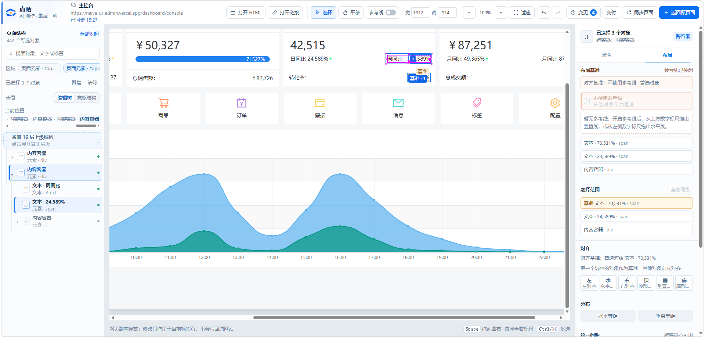
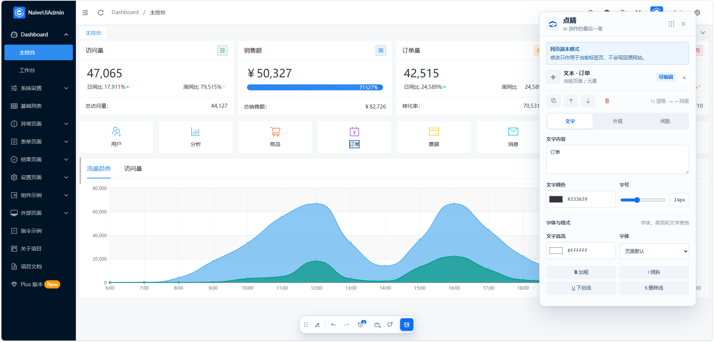
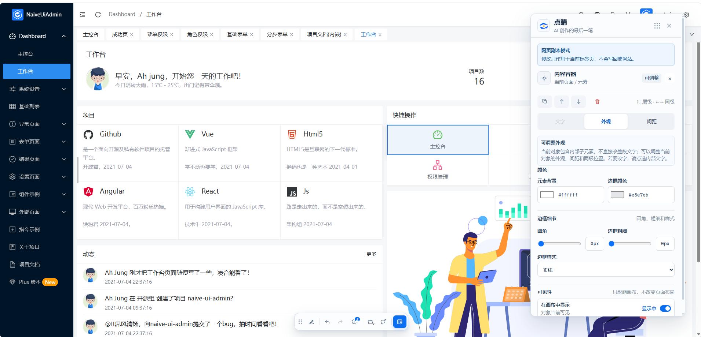
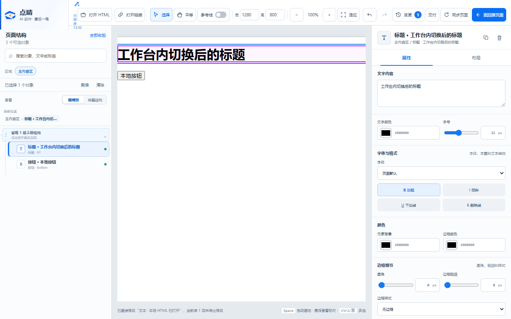

# 点睛

> **AI 创作的最后一笔。**

AI 已经把网页、原型或 HTML 演示做出来了，最后几个字、颜色、间距和布局却常常还要回到提示词或源码里反复沟通。

点睛（Dianjing）是面向网页设计、AI 原型和 HTML 演示的浏览器端最后一公里编辑器。它让你直接在真实页面上选中对象，用 Dock 快速修改，或进入完整工作台像使用 Axure 一样精修已有原型。能安全落地的改动当场完成，不能直接写回源码的部分会整理成清楚的交接提示词，再交给开发工具或 AI Agent。

**一句话理解：不是画龙，是点睛。页面已经有了，用点睛完成交付前的最后一轮精修。**

[看看它怎么工作](#先看它怎么工作) · [安装并开始使用](#安装并开始使用) · [查看试用指南](docs/product/user-guide.md) · [联系与反馈](#联系与反馈)

## 为什么需要点睛

| 原来的做法                                         | 使用点睛之后                                   |
| -------------------------------------------------- | ---------------------------------------------- |
| 为了改几个字或间距，重新描述需求、等待 AI 再生成   | 在真实页面上点选对象，直接修改并即时看到结果   |
| 不确定 AI 又改动了哪些无关部分                     | 每次改动都有记录，可以撤销、重做或取消单项修改 |
| 产品、设计和开发在截图、口头描述、源码之间来回确认 | 把对象、修改前后值和限制整理成明确的交接提示词 |
| 页面改完后还要另外想办法截图、保存或交付           | 导出离线 HTML 或整页 PNG，保留当前视觉结果     |

## 一个产品，两种工作方式

| 工作方式   | 适合什么时候用                               | 怎么工作                                                                | 典型任务                                                    |
| ---------- | -------------------------------------------- | ----------------------------------------------------------------------- | ----------------------------------------------------------- |
| Dock       | 当前页面上有一个明确的小问题，需要立即改     | 不离开网页，点中对象后快速修改文字、外观、间距、层级和可见性            | 改标题、换颜色、调字号和留白、当场修正评审意见              |
| 完整工作台 | 需要全局视野、精确布局或同时处理多个页面对象 | 在“页面结构树 + 真实画布 + 属性/布局面板”中选择、移动、缩放、对齐和重组 | 像 Axure 一样精修已有 HTML 原型、整理演示版式、完成静态交付 |

两种方式共享当前页面、选中对象和修改记录。Dock 追求快，完整工作台追求看得全、调得准；它们都从已有页面开始，不负责从空白构建内容。

## 案例：不用再对 AI 说“往左一点”

页面已经基本完成，只是一个标题、按钮或卡片偏了十几个像素。过去常见的沟通是：

> “把它往左一点。”
>
> 等待页面重新生成。
>
> “再往左一点……其他地方别动。”

问题不在于 AI 不会改，而在于你很难用语言说清最后这点视觉距离，也无法保证重新生成时没有牵连其他内容。

在点睛中，你可以直接选中对象，在真实页面上把它拖到合适位置。结果当场可见，位置变化进入修改记录，拖错了可以撤销；需要交给开发或 AI Agent 时，还能保留对象和位置变化等具体信息。



这不是让 AI 重新做一遍页面，而是由你亲手完成交付前最后几像素的判断。

## 四个核心场景

1. **网页设计与 AI 页面精修**：AI 或开发者已经生成网页、落地页或看板，产品经理和设计师直接调整文案、颜色、字号、边距、尺寸和模块位置。
2. **HTML 做演示或“HTML 做 PPT”**：整理用 HTML 制作的汇报页、演示稿和数据故事，调整标题层级、图文位置与版式，再导出离线 HTML 或整页 PNG。这里不指生成 `.pptx` 文件。
3. **像 Axure 一样精修原型**：打开已有 HTML 原型，通过对象树、真实画布和属性/布局面板处理单选、多选、对齐、分布、移动、缩放和结构调整。
4. **评审现场修改与开发交接**：看到问题就当场修改、撤销和比较，再把无法直接写回源码的结果整理成精确提示词交给开发或 AI Agent。

## 先看它怎么工作

### 1. 用 Dock 在当前页面快速修改

选中页面里的文字或模块后，Dock 会判断对象是否适合直接编辑，并提供文字、外观、间距、层级、撤销和修改记录等操作。修改只作用于当前页面会话或导出的副本，不会悄悄改写网站服务器。



### 2. 不离开页面调整外观

颜色、边框、圆角、字号和间距等常见视觉细节可以在当前页面上确认。你看到的就是调整后的真实结果，不需要在截图、提示词和源码之间来回猜测。



### 3. 进入完整工作台，像 Axure 一样精修已有原型

完整工作台把页面结构、真实画布和属性/布局面板放在同一个界面中，适合打开本地 HTML、选择多个对象、移动与缩放、对齐与分布、调整结构，并导出离线 HTML 或整页 PNG。它提供类似 Axure 的对象编辑感受，但不从空白绘制页面或编排完整交互逻辑。



> 截图来自当前版本的公开演示页面和脱敏测试页面，仅用于展示产品界面与操作方式，不包含真实业务数据。

## 安装并开始使用

### 普通试用者安装

点睛目前是 Alpha 版，尚未上架 Chrome 扩展商店。首个 Release 发布后，请只从项目的 [Releases 页面](https://github.com/alexFD9533/dianjing/releases) 下载名称类似 `dianjing-v0.1.0-alpha.zip` 的安装包；发布前也可以向项目维护者索取经过验证的安装包。

1. 把下载的 ZIP 完整解压到一个固定文件夹；
2. 在 Chrome 地址栏输入 `chrome://extensions`；
3. 打开页面右上角的“开发者模式”；
4. 点击“加载已解压的扩展”；
5. 选择刚才解压后、里面直接包含 `manifest.json` 的文件夹；
6. 在浏览器扩展菜单中找到“点睛”，建议将它固定到工具栏。

不要直接从 ZIP 内运行，也不要安装来自陌生网盘或非本项目 Release 页面的扩展包。更新 Alpha 版本时，请重新下载、解压并重新加载，不要同时保留两个不同版本。

### 第一次使用

第一次不用学习全部功能，只完成一条最短体验路径：

1. 打开一个不含账号、客户数据或内部地址的测试网页；
2. 点击浏览器工具栏里的“点睛”，按 Chrome 提示授权当前站点；
3. 选中一个标题、按钮或卡片，直接修改文字、颜色或间距；
4. 在完整工作台中把一个对象拖动一点，确认位置变化立即生效；
5. 打开修改记录，尝试撤销和重做；
6. 导出一张整页 PNG，或把结果导出为离线 HTML。

完成后，你就能判断点睛是否适合自己的 AI 页面精修和交付流程。更多说明和反馈模板见 [点睛试用指南](docs/product/user-guide.md)。

### 可以让 AI 帮忙安装吗？

可以协助，但不能静默绕过 Chrome 的安全限制。具备电脑操作能力并获得你授权的 AI 助手，可以帮你找到官方安装包、解压文件、打开扩展管理页并指引“加载已解压的扩展”；是否能直接点击浏览器内部页面取决于该 AI 工具的权限。安装来源确认、开发者模式和本地文件夹选择等安全步骤，应当在你看得到并同意的情况下完成。

## 谁最适合

- 用 AI 生成了网页或 HTML 原型，想像调整演示稿一样完成最后一轮细节修改；
- 用 HTML 制作汇报、演示页面或数据故事，希望整理版式并交付离线结果；
- 已经有可运行原型，希望像使用 Axure 一样查看结构并精确调整已有对象；
- 产品、设计、运营等不想为了改几个字、颜色或间距反复进入源码；
- 需要把修改结果导出为静态 HTML、整页 PNG，或整理成可交给开发工具/AI Agent 的提示词。

点睛目前更适合已有页面的“最后一公里”视觉调整和静态交付，不适合替代 AI 网页生成器、Axure、Figma、PPT 或完整前端开发环境，也不承诺从零构建内容、生成 `.pptx`，或直接写回 React、TSX、Vue 等源码。

## 文档导航

| 层级        | 入口                                                                                                   | 职责                                                   |
| ----------- | ------------------------------------------------------------------------------------------------------ | ------------------------------------------------------ |
| current     | [docs/product](docs/product/README.md)、[apps/dock-extension/README.md](apps/dock-extension/README.md) | 当前产品定义、品牌、Alpha 范围和正式扩展行为           |
| governance  | [docs/governance](docs/governance/repository-workflow.md)                                              | 分支、选择性提交、PR、台账和发布流程                   |
| engineering | [docs/open-source](docs/open-source/README.md)                                                         | 架构、信任边界、流程、权限、变量和测试证据             |
| archive     | 本地归档分支/历史目录                                                                                  | 旧版插件、原型和历史文档，仅用于追溯，不是公开运行入口 |
| internal    | 本地内部记录与历史资料                                                                                 | 项目过程、路线图、优化台账和历史资产，不进入公开主线   |

当前公开开发目标是新版 MV3 扩展：

- **Dock**：在当前页面中快速选择和修改对象；
- **完整工作台**：处理多对象布局、结构调整、历史、离线 HTML 和整页 PNG 导出；
- **AI 交接**：生成提示词并复制到剪贴板，不在扩展内执行外部 Agent。

正式运行入口是 `apps/dock-extension`。`apps/extension` 是旧版实现，`apps/demo-pages` 是历史原型/演示工程，`third_party/clickdeck` 是外部参考实现；它们不属于当前公开运行路径。

## 开发者从源码构建

需要准备 Node.js 20+、pnpm 10.33.0，以及 Chrome 或 Chromium。

安装和构建：

```powershell
pnpm install --frozen-lockfile
pnpm build:dock
```

打开 `chrome://extensions`，启用“开发者模式”，选择“加载已解压的扩展”，加载 `apps/dock-extension/dist`。

基础检查：

```powershell
pnpm typecheck
pnpm test
pnpm build:dock
```

公开合并前的聚合门槛：

```powershell
pnpm verify:public
```

它依次运行公开格式检查、lint、typecheck、unit、正式构建、Dock E2E 和 Workspace E2E。自动化通过不等于用户已验收；涉及页面行为仍需在目标 Chromium 中重新加载扩展并记录证据。

完整浏览器回归需要先安装 Playwright Chromium：

```powershell
pnpm exec playwright install chromium
pnpm test:dock:e2e
pnpm test:dock:workspace
```

## 支持范围

首个公开版本优先支持本地 HTML、localhost 和用户主动授权的普通网页副本。修改保存在当前会话或导出的静态副本中，不直接写回 React、TSX、Vue 等源码，也不上传用户正在编辑的页面内容。

暂不承诺任意动态网站的完整编辑、跨域 iframe、Shadow DOM、复杂 Canvas 内部编辑或服务器源码回写。详细的权限、数据流和已知限制见 docs/open-source。

## 仓库结构

```text
apps/dock-extension/       当前正式浏览器扩展
packages/contracts/        页面修改协议与数据校验
packages/selector-engine/  稳定 DOM 目标定位
scripts/                   构建后的插件回归验证
docs/product/              当前产品、品牌和 Alpha 范围
docs/governance/           Git、PR 和发布流程
docs/open-source/          面向审查者和贡献者的工程说明
```

## 参与贡献

请先阅读 [CONTRIBUTING.md](CONTRIBUTING.md)、[仓库工作流](docs/governance/repository-workflow.md) 和 [发布清单](docs/governance/release-checklist.md)。正式公开改动必须从最新 `origin/main` 的干净分支开始，选择性暂存，禁止 `git add .`。安全问题请不要公开提交到 Issue，见 SECURITY.md。当前仍处于 Alpha 阶段，产品边界和数据模型可能继续调整。

## 联系与反馈

- 公开的问题、建议和功能需求：请提交 [GitHub Issue](https://github.com/alexFD9533/dianjing/issues)，方便其他试用者查看和补充；
- 使用咨询、合作交流或不适合公开讨论的内容：发送邮件至 [280845201@qq.com](mailto:280845201@qq.com)；
- 安全漏洞：请按照 [SECURITY.md](SECURITY.md) 私下报告，不要先在公开 Issue 中披露可利用细节。

反馈时请尽量说明使用场景、复现步骤、浏览器和点睛版本。截图或示例 HTML 请先移除账号、Token、客户数据、内部地址和其他私人信息。发送邮件时建议在主题中加上“点睛”，便于识别。

本项目使用 Apache-2.0 许可证。项目名称、图标和品牌素材不因代码许可证自动获得商标授权。

## 历史与内部资料

公开 `main` 不重新引入 `apps/extension`、`apps/demo-pages`、`third_party`、`docs/archive`、`apps/product-board` 或本地过程资料。它们若存在于开发者机器，只能作为本地历史/内部记录保留；删除前应先完成可恢复归档。当前源代码已公开，Alpha 版本可自行构建试用，但尚未发布到浏览器扩展商店。
