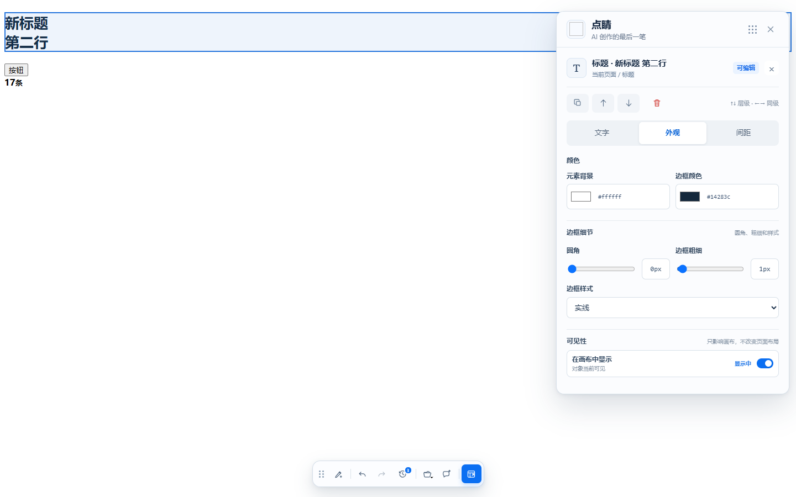

# 点睛

> **AI 创作的最后一笔。**

点睛（Dianjing）是一款面向 AI 生成页面和本地 HTML 的浏览器端最后一公里编辑器。用户可以在真实渲染页面上选择稳定 DOM 对象，完成文字、外观、间距和布局调整，并保留撤销、历史、导出和交付记录。

点睛不是源码生成器，也不是任意网页的服务器端编辑器。它先处理可以安全落地的视觉微调，再把无法直接写回源码的结果整理成稳定的交接提示词，由用户复制给自己的开发工具或 AI Agent。

## 先看它怎么工作

### 1. 在当前页面直接调整

选中页面里的文字或模块后，Dock 会判断对象是否适合直接编辑，并提供文字、外观、间距、层级、撤销和修改记录等操作。修改只作用于当前页面会话或导出的副本，不会悄悄改写网站服务器。



### 2. 进入完整工作台处理复杂调整

完整工作台把页面结构、真实画布和属性面板放在同一个界面中，适合打开本地 HTML、选择多个对象、调整布局与尺寸，并导出离线 HTML 或整页 PNG。


> 截图来自当前版本的脱敏测试页面，仅用于展示产品界面与操作方式，不包含真实业务数据。

## 适合谁

- 用 AI 生成了网页或 HTML 原型，想像调整演示稿一样完成最后一轮细节修改；
- 产品、设计、运营等不想为了改几个字、颜色或间距反复进入源码；
- 需要把修改结果导出为静态 HTML、整页 PNG，或整理成可交给开发工具/AI Agent 的提示词。

点睛目前更适合“最后一公里”的视觉调整和静态交付，不适合替代完整的前端开发环境，也不承诺直接写回 React、TSX、Vue 等源码。

## 文档导航

| 层级        | 入口                                                                                                   | 职责                                                   |
| ----------- | ------------------------------------------------------------------------------------------------------ | ------------------------------------------------------ |
| current     | [docs/product](docs/product/README.md)、[apps/dock-extension/README.md](apps/dock-extension/README.md) | 当前产品定义、品牌、Alpha 范围和正式扩展行为           |
| governance  | [docs/governance](docs/governance/repository-workflow.md)                                              | 分支、选择性提交、PR、台账和发布流程                   |
| engineering | [docs/open-source](docs/open-source/README.md)                                                         | 架构、信任边界、流程、权限、变量和测试证据             |
| archive     | 本地归档分支/历史目录                                                                                  | 旧版插件、原型和历史文档，仅用于追溯，不是公开运行入口 |
| internal    | 本地内部记录与历史资料                                                                                | 项目过程、路线图、优化台账和历史资产，不进入公开主线   |

当前公开开发目标是新版 MV3 扩展：

- **Dock**：在当前页面中快速选择和修改对象；
- **完整工作台**：处理多对象布局、结构调整、历史、离线 HTML 和整页 PNG 导出；
- **AI 交接**：生成提示词并复制到剪贴板，不在扩展内执行外部 Agent。

正式运行入口是 `apps/dock-extension`。`apps/extension` 是旧版实现，`apps/demo-pages` 是历史原型/演示工程，`third_party/clickdeck` 是外部参考实现；它们不属于当前公开运行路径。

## 现在就试用

源代码已经在 GitHub 公开，目前通过本地构建加载，尚未上架 Chrome 扩展商店。第一次试用需要准备 Node.js 20+、pnpm 10.33.0，以及 Chrome 或 Chromium。

安装和构建：

```powershell
pnpm install --frozen-lockfile
pnpm build:dock
```

打开 chrome://extensions，启用“开发者模式”，选择“加载已解压的扩展”，加载 apps/dock-extension/dist。

基础检查：

```powershell
pnpm typecheck
pnpm test
pnpm build:dock
```

公开合并前的聚合门槛：

```powershell
pnpm verify:public
```

它依次运行公开格式检查、lint、typecheck、unit、正式构建、Dock E2E 和 Workspace E2E。自动化通过不等于用户已验收；涉及页面行为仍需在目标 Chromium 中重新加载扩展并记录证据。

完整浏览器回归需要先安装 Playwright Chromium：

```powershell
pnpm exec playwright install chromium
pnpm test:dock:e2e
pnpm test:dock:workspace
```

## 支持范围

首个公开版本优先支持本地 HTML、localhost 和用户主动授权的普通网页副本。修改保存在当前会话或导出的静态副本中，不直接写回 React、TSX、Vue 等源码，也不上传用户正在编辑的页面内容。

暂不承诺任意动态网站的完整编辑、跨域 iframe、Shadow DOM、复杂 Canvas 内部编辑或服务器源码回写。详细的权限、数据流和已知限制见 docs/open-source。

## 仓库结构

```text
apps/dock-extension/       当前正式浏览器扩展
packages/contracts/        页面修改协议与数据校验
packages/selector-engine/  稳定 DOM 目标定位
scripts/                   构建后的插件回归验证
docs/product/              当前产品、品牌和 Alpha 范围
docs/governance/           Git、PR 和发布流程
docs/open-source/          面向审查者和贡献者的工程说明
```

## 参与贡献

请先阅读 [CONTRIBUTING.md](CONTRIBUTING.md)、[仓库工作流](docs/governance/repository-workflow.md) 和 [发布清单](docs/governance/release-checklist.md)。正式公开改动必须从最新 `origin/main` 的干净分支开始，选择性暂存，禁止 `git add .`。安全问题请不要公开提交到 Issue，见 SECURITY.md。当前仍处于 Alpha 阶段，产品边界和数据模型可能继续调整。

如果你只是试用产品，不需要先学会提交代码：可以直接通过 [GitHub Issues](https://github.com/alexFD9533/dianjing/issues) 报告问题或提出建议。请说明使用场景、复现步骤和浏览器版本；截图或示例 HTML 请先移除账号、客户数据、内部地址和其他私人信息。

本项目使用 Apache-2.0 许可证。项目名称、图标和品牌素材不因代码许可证自动获得商标授权。

## 历史与内部资料

公开 `main` 不重新引入 `apps/extension`、`apps/demo-pages`、`third_party`、`docs/archive`、`apps/product-board` 或本地过程资料。它们若存在于开发者机器，只能作为本地历史/内部记录保留；删除前应先完成可恢复归档。当前源代码已公开，Alpha 版本可自行构建试用，但尚未发布到浏览器扩展商店。
